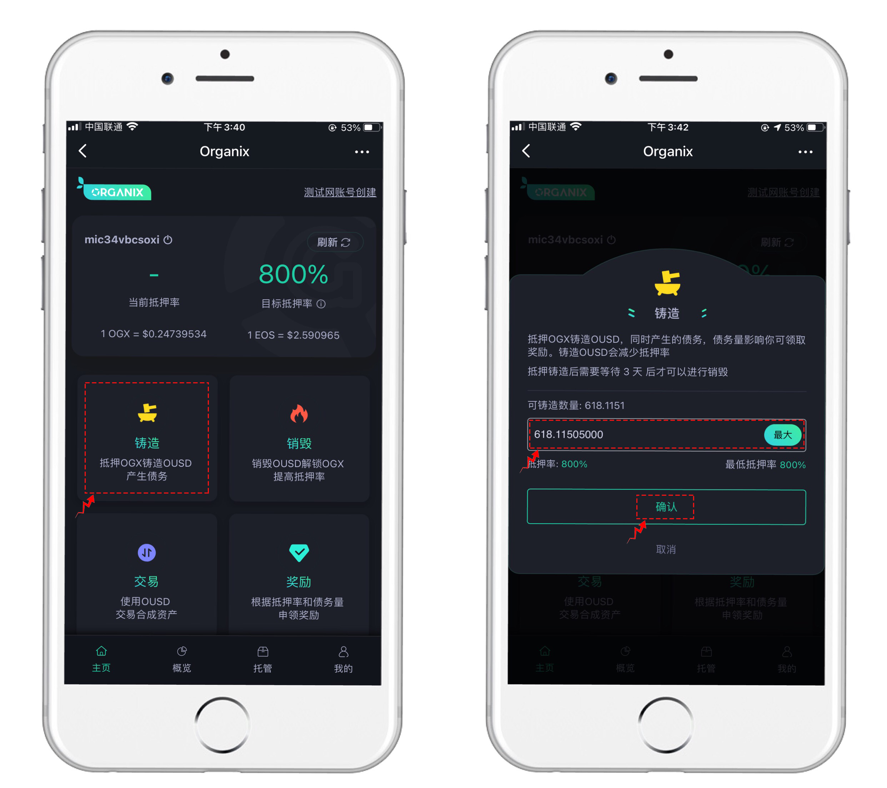

# 如何抵押

## 基本步骤

第一步：登录

使用支持EOS的钱包登录，如TokenPocket、Scatter等

第二步：抵押

点击【铸造】，抵押OGX来铸造OUSD，设置数量后即可授权完成铸造。

\*抵押者只能以至少800%的抵押率来铸造OUSD，如果抵押人持有的OGX价值为800美元，则可以铸造100美元的OUSD。800%的抵押率后期也有可能会进行调整。

\*如果OGX令牌的价值增加，您将能够创造更多OUSD。 而且，如果OGX代币的价值下降，抵押者铸造的OUSD价值和对全球债务的贡献将保持不变。 但是，OGX价值的降低可能会使得抵押率降低，若低于800%将领取不到通胀奖励和交易奖励。

\*抵押者可以随时将OGX添加到钱包并进行更多抵押、或销毁OUSD，保证抵押率保持在800％或以上。

